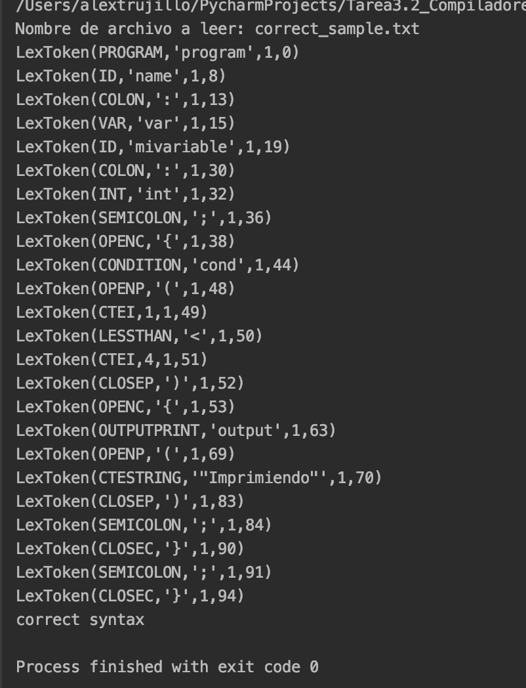
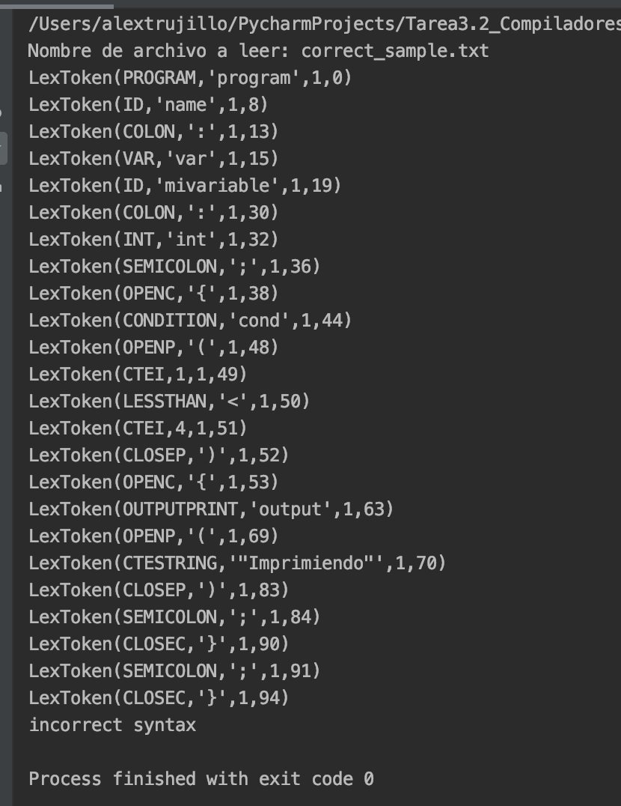

# Tarea 3.2 Little Duck 2020
### Valentin Alexandro Trujillo García A01328426

Acontinuación se encuentra la documentación de la 
actividad 3.2 little duck de la clase  de Diseño de Compladores


Cómo ejecutar
==========

Hay dos formas de ejecutar el código. 
1. Para el desarrollo de esta actividad se utilizó la herramienta PyCharm de intelliJ.
Utilizando esa herramienta solo hay que importar el proyecto y oprimir el botón de
ejecutar que se encuentra en la barra de herraminetas de la parte superior con el símbolo de 'Play'

2. Si se está ejecutando python desde una terminal solo hay que situarse en la carpeta del proyecto
y ejecutar el siguiente comando:
```python
python3 main.py
```

Las pruebas
==========
Dentro del repositorio se encuentran dos documentos .txt para las pruebas
requeridas en esta actividad.

Para probar una u otra hay que cambiar la linea de código: 238
con los siguentes cambios:

Prueba Compilación exitosa
======
Para probar código que compila CORRECTAMENTE (Default):
```python
arch_name = 'correct_sample.txt'
```
Output de ejemplo:


Prueba Compilación NO exitosa
======
Para probar código Incorrecto hay que cambiar la línea por la siguiente:
```python
arch_name = 'incorrect_sample.txt'
```
Output de ejemplo:



Requirements
============

[Python 3](https://www.python.org/downloads/)

[Pycharm](https://www.jetbrains.com/es-es/pycharm/download/)

Recursos
============

Para el desarrollo de esta actividad se utilizó [Python 3](https://www.python.org/downloads/)

Así comoalgunas herramientas online de infirmación como: [Matthieuamiguet 3](https://www.matthieuamiguet.ch/media/documents/TeachingCompilersWithPython_Slides.pdf)

Para la creeaciónde expreciones [Regexr 3](https://regexr.com/50h0n)

Y finalmente la integración de Lex and Yacc se usó la librería [Ply](https://www.dabeaz.com/ply/ply.html
)


El código
=======

A continuación el código desarrollado:

```python
# ------------------------------------------------------------
# Valentin Alexandro Trujillo García
# A01328426
# Compiladores
# ------------------------------------------------------------
import ply.lex as lex
import ply.yacc as yacc
# List of token names.   This is always required
# RESERVED WORDS
reserved = {
    'cond': 'CONDITION',
    'else': 'ELSE',
    'int': 'INT',
    'float': 'FLOAT',
    'output': 'OUTPUTPRINT',
    'program': 'PROGRAM',
    'var': 'VAR',
}

# LIST OF TOKENS
tokens = [
         'CTEI', 'CTEF', 'CTESTRING', 'ID',
         'TIMES', 'DIVIDE', 'SEMICOLON',
         'OPENP', 'CLOSEP', 'COMA',
         'OPENC', 'CLOSEC', 'COLON',
         'EQUAL', 'GREATERTHAN', 'LESSTHAN',
         'DIFERENT', 'MINUS', 'PLUS',
         ] + list(reserved.values())

t_MINUS = r'\-'
t_PLUS = r'\+'
t_TIMES = r'\*'
t_DIVIDE = r'\/'
t_SEMICOLON = r'\;'
t_OPENP = r'\('
t_CLOSEP = r'\)'
t_COMA = r'\,'
t_EQUAL = r'\='
t_OPENC = r'\{'
t_CLOSEC = r'\}'
t_COLON = r'\:'
t_GREATERTHAN = r'\>'
t_LESSTHAN = r'\<'
t_DIFERENT = r'\<>'
t_ignore = ' \t\n' # A string containing ignored characters (spaces and tabs)

# Rules: https://regexr.com/ ==================================== BEGGINING

def t_error(t):
    print("Illegal character '%s'" % t.value[0])
    t.lexer.skip(1)

def t_CTEF(t):
    r'[-+]?\d*\.\d+'
    t.value = float(t.value)
    return t

def t_CTEI(t):
    r'0|[-+]?[1-9][0-9]*'
    t.value = int(t.value)
    return t

def t_CTESTRING(t):
    r'\'[\w\d\s\,. ]*\'|\"[\w\d\s\,. ]*\"'
    return t

def t_ID(t):
    r'[a-zA-Z][a-zA-Z_\d]*'
    t.type = reserved.get(t.value, 'ID')
    return t

# Rules: https://regexr.com/ ==================================== ENDING

# Build the lexer
lexer = lex.lex()

# PARSING rules ================================================ BEGGINING

def p_programa(p):
    '''
        programa : PROGRAM ID COLON programAux
    '''
    p[0] = 'PROGRAM COMPILED'

def p_programAux(p):
    '''
        programAux : vars bloque COLON vars
        programAux : vars bloque
        | vars
    '''

def p_vars(p):
    '''
        vars : VAR d
    '''

def p_varsAux(p):
    '''
        varsAux : COLON tipo SEMICOLON w
          | COMA d
    '''

def p_w(p):
    '''
        w : d
          | empty
    '''

def p_d(p):
    '''
        d : ID varsAux
    '''

def p_tipo(p):
    '''
        tipo : INT
             | FLOAT
    '''

def p_bloque(p):
    '''
        bloque : OPENC blockAux CLOSEC
    '''

def p_blockAux(p):
    '''
        blockAux : estatuto
          | estatuto blockAux
          | empty
    '''

def p_estatuto(p):
    '''
        estatuto : asignacion
                 | condicion
                 | escritura
    '''

def p_asignacion(p):
    '''
        asignacion : ID EQUAL expresion SEMICOLON
    '''

def p_escritura(p):
    '''
        escritura : OUTPUTPRINT OPENP escrituraAux CLOSEP SEMICOLON
    '''

def p_escrituraAux(p):
    '''
        escrituraAux : expresion
          | expresion COMA escrituraAux
          | CTESTRING
          | CTEI
          | CTEF
    '''

def p_condicion(p):
    '''
        condicion : CONDITION OPENP expresion CLOSEP condicionAux SEMICOLON
    '''

def p_condicionAux(p):
    '''
        condicionAux : bloque
          | bloque ELSE bloque
    '''

def p_expresion(p):
    '''
        expresion : exp x
    '''

def p_expresionAux(p):
    '''
        x : GREATERTHAN exp
          | LESSTHAN exp
          | DIFERENT exp
          | empty
    '''

def p_exp(p):
    '''
        exp : termino
            | termino PLUS exp
            | termino MINUS exp
    '''

def p_termino(p):
    '''
        termino : factor
                | factor TIMES termino
                | factor DIVIDE termino
    '''

def p_factor(p):
    '''
        factor : factorA
               | factorB
    '''

def p_factorA(p):
    '''
        factorA : OPENP expresion CLOSEP
    '''

def p_factorB(p):
    '''
        factorB : varcte
                | PLUS varcte
                | MINUS varcte
    '''

def p_varcte(p):
    '''
        varcte : ID
               | CTEI
               | CTEF
    '''

def p_empty(p):
    '''
        empty :
    '''
    p[0] = None

# Error rule for syntax errors
def p_error(p):
   print("Syntax error in input!", p)

# PARSING rules ================================================ ENDING

# Instanciate the Lexer
yacc.yacc()

def main():
    try:
        arch_name = 'correct_sample.txt'
        arch = open(arch_name, 'r')
        print("Nombre de archivo a leer: " + arch_name)
        info = arch.read()
        arch.close()
        lexer.input(info)
        while True:
            tok = lexer.token()
            if not tok:
                break
            print(tok)
        if (yacc.parse(info, tracking=True) == 'PROGRAM COMPILED'):
            print("correct syntax")
        else:
            print("syntax error")
    except EOFError:
        print(EF)


main()

```


